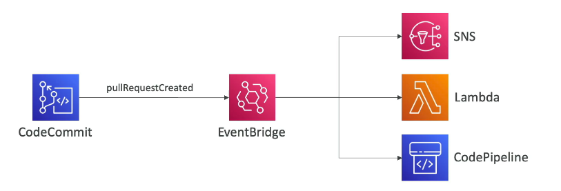
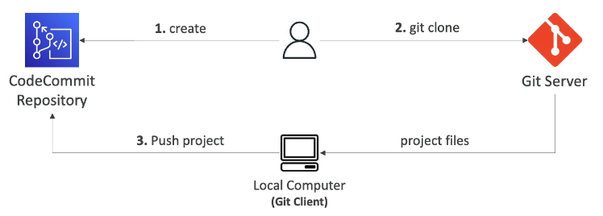
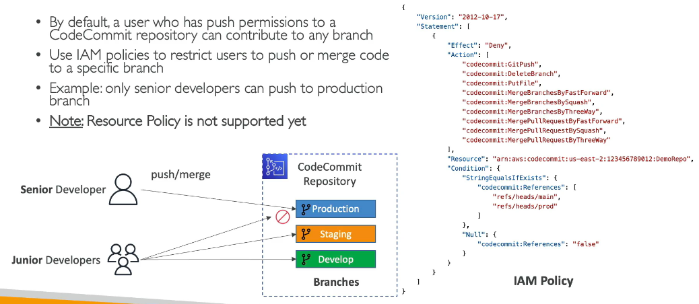
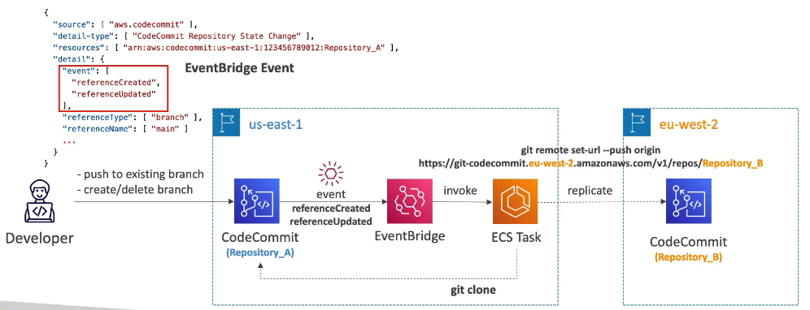
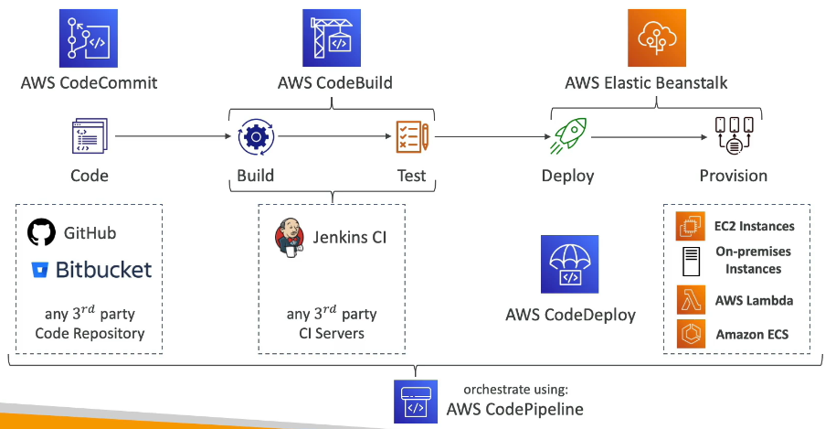
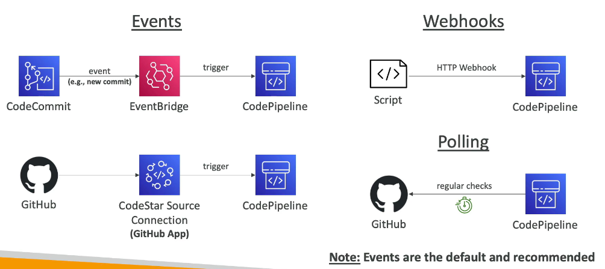
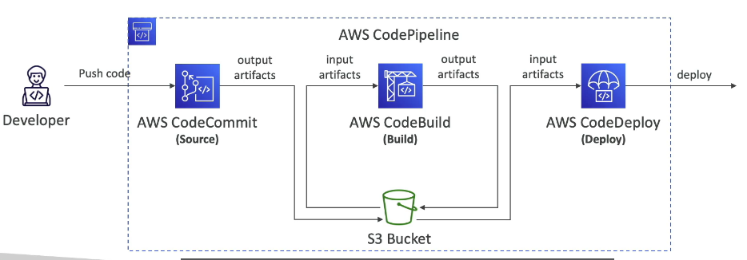
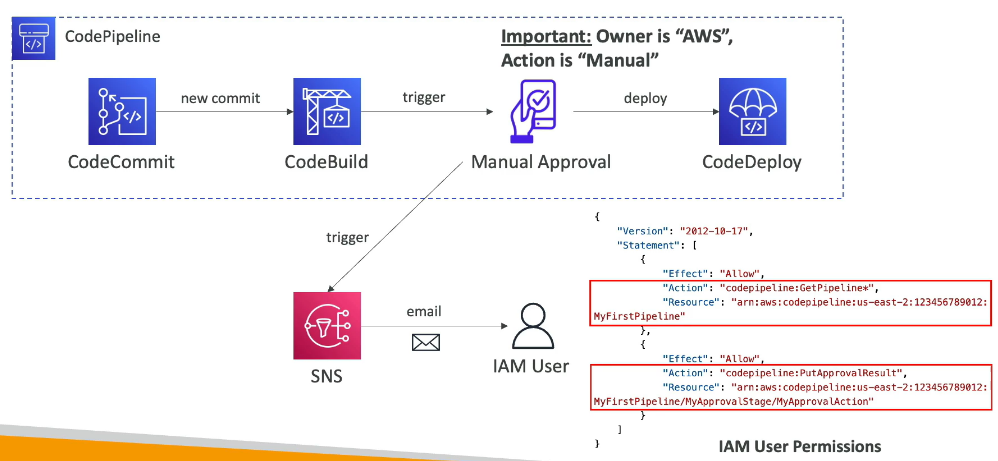
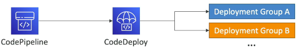
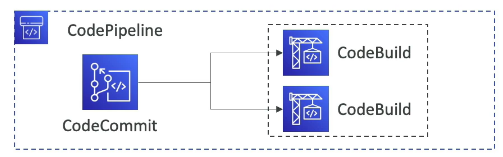

# AWS

## EC2

## S3

A scalable and object-based cloud storage service:

* Must globally unique name

* Regional level

* 5TB maximum object size

* If uploading more than 5GB, use multi-part upload

*  Object KEY: Prefix + Object name:
    
    S3://my-bucket/my_folder/my-file.txt

### Storage Classes
* S3 Standard - General Purpose
* Infrequent Access
* One Zone-Infrequent Access
* Glacier
* Glacier Instant Retrieval

### Security
**User-Based:**

IAM Policies - allow API call for a specific user

**Resource-Based:**

* Bucket Policies
* Object ACL
* Bucket ACL

### Replication (Cross-Region and Same-Region)

* must enable versioning in source and destination bucket

* must give IAM Permissions to S3

* only new objects are replicated

* To replicate existing objects use S3 Batch Replication

---

## RDS

### Monitoring

* `FreeStorageMetric` metric to monitor the available storage space for an RDS DB instance

* `FreeableMemory` metric tracks the amount of available random access memory

* `DiskQueueDepth` metric provides the number of outstanding IOs (read/write requests) waiting to access the disk.

* `BinLogDiskUsage` metric tracks the amount of disk space occupied by binary logs on the master. This only applies to MySQL read replicas.

---

## CloudWatch

Basic Monitoring:
> 5 minutes interval

Detailed Monitoring:
> Less than 5 minutes interval

Test Alarm :

    aws cloudwatch set-alarm-state --alarm-name "myalarm" --state-value ALARM --state-reason "testing purposes"

---

## Application Load Balancer

* Works with web traffic (HTTP/HTTPS)
* Can support HTTP/2 and WebSocket connections
* Can redirect users from HTTP to HTTPS
* Sends traffic to different servers based on rules like:
    * URL path (e.g., `/users`, `/posts`)
    * Domain name (e.g., `one.example.com`, `other.example.com`)
    * Query strings or headers (e.g., `?id=123`)
* Useful for microservices and container apps (like ECS)
* Can route traffic to the correct container port automatically (dynamic port mapping)

### Target Group

* Auto Scaling Group
* Lambda Functions
* Must be private IPs
* Can route to multiple target groups
* Health checks are at the target group level 

### Sticky Sessions

* Always redirected to the same instance, so user doesn't lose his session data
* Cookie used for stickiness has an expiration date 
* May imbalance the load to ec2 instance

---

## CodeCommit
A fully managed private git repositories 

Connection Methods:

* HTTPS Git
* SSH Public Key
* AWS CLI Helper

### Monitoring with EventBridge
Monitor events in CodeCommit near real-time such as `pullRequestCreated`, `pullRequestStatusChanged`, `referenceCreated`, `commentOnCommitCreated`

### Migrate Git Repository to CodeCommit

1. Create a CodeCommit Repository
2. Clone the repo from GitHub to your Local machine
3. Push it to CodeCommit Repostory

### Branch Security
* By default, a user who has push permissions to a CodeCommit repository can contribute to any branch
* Use IAM policies to restrict users to push or merge code to a specific branch:

    **E.g.**: only senior developers can push to production branch

### Pull Request Approval Rules

- Helps ensure the quality of your code by requiring user(s) to approve the open PRs before the code can be merge
- Specify a **pool of users** to approve and number of users who must approve the PR
- Specify IAM Principal ARN (IAM users, federated users, IAM Roles, IAM Groups)
- Approval Rule Templates:
    - Automatically apply Approval Rules to PRs in specific repositories
    - E.g.: define different rules for dev and prod branches

### Cross-Region Replication
Lower latency pulls for global developers, backups, ...

---

## CodePipeline
Visual Workflow to Orchestrate CI/CD

* **Source** - CodeCommit, ECR, S3, GitHub
* **Build** -  CodeBuild, Jenkins, CloudBees, TeamCity
* **Test** - CodeBuild, AWS Device Farm, 3rd party tools
* **Deploy** - CodeDeploy, Elastic Beanstalk, CloudFormation, ECS, S3

### Events vs Webhooks vs Pooling

### Artifacts 
The files, code, and binaries that move through the pipeline

- Each pipeline stage can create artifacts

- Artifacts are stored in S3 Bucket and passed to the next stage

### Manual Approval Stage

### Troubleshooting
- Use EventBridge to create events for failed or cancelled pipelines
- CloudTrail to audit API calls

### Best Practices

OneCodePipeline, One CodeDeploy, Parallel Deploy to Mutiple Deployment Groups\

Parallel Actions using in a Stage **RunOrder**

Deploying to Pre-Prod before deploying to Prod

Multi Region
- Actions in pipeline can be different regions
- S3 Artifacts Store must be defined in each regions where you have actions
- CodePipeline handles the copying of input artifacts from on AWS Region to other Regions when performing cross-region actions
---

## CodeBuild